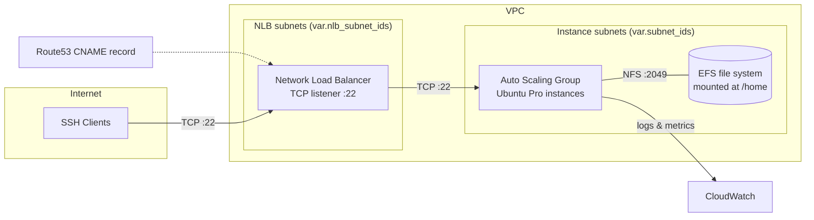

# Architecture

This document explains how the InfraHouse jumphost module works.

## Overview

A client resolves the jump host name via Route53, connects to the NLB on port 22, and the
NLB forwards the SSH session to a healthy instance in the Auto Scaling Group. All instances
mount the same EFS file system at `/home`, so user data is identical on every instance and
survives instance replacements.

## Components

### Network Load Balancer

`nlb.tf` creates the NLB, a TCP listener on port 22, and a target group.

- **Scheme is inferred, not configured**: the module checks `map_public_ip_on_launch` of the
  first subnet in `var.nlb_subnet_ids`. Public subnets produce an internet-facing NLB,
  private subnets an internal one.
- **Stickiness**: the target group uses `source_ip` stickiness, so a client keeps talking
  to the same instance across connections.
- **Health checks**: TCP on port 7 (echo). The echo service is configured on the instances
  by Puppet. Checking a separate port instead of SSH itself avoids polluting SSH logs with
  health check connection noise.
- **Cross-zone load balancing** is enabled, so all instances receive traffic regardless of
  which availability zone the client lands in.

### Auto Scaling Group

`main.tf` creates the launch template and the ASG:

- **Sizing defaults**: minimum size defaults to the number of instance subnets;
  maximum size to that number plus one.
- **AMI**: the latest Ubuntu Pro image for `ubuntu_codename` (published by Canonical),
  unless `ami_id` is provided.
- **Maximum instance lifetime**: 90 days — instances are recycled regularly, which keeps
  them close to a freshly patched state.
- **Rolling instance refresh**: triggered by tag changes, replacing instances while keeping
  100% of the minimum capacity in service.
- **Spot support**: setting `on_demand_base_capacity` switches the ASG to a mixed instances
  policy — that many on-demand instances, spot for the rest.
- **IMDSv2 required**: the launch template enforces `http_tokens = "required"`.

### EFS Home Directory

`efs-enc.tf` creates an encrypted EFS file system with a mount target in every instance
subnet. Cloud-init mounts it at `/home` over NFSv4.1, so every instance sees the same home
directories and nothing is lost when an instance is replaced.

- **Encryption**: always on. AWS managed key by default, or bring your own via
  `efs_kms_key_arn`.
- **Creation token**: `efs_creation_token` must be unique per EFS file system in an AWS
  account. Deploying multiple jumphosts requires distinct tokens.

!!! warning "Changing `efs_creation_token` recreates the file system"

    The creation token forces a new EFS file system. Changing it on an existing deployment
    destroys all home directories.

### SSH Host Keys and Key Pair

`ssh.tf` generates RSA, ECDSA, and ED25519 host keys with the Terraform TLS provider and
passes them to every instance via cloud-init. Because all instances share the same host
keys, the jump host has a stable SSH identity: clients never see "host key changed"
warnings after an instance is replaced. Bring your own keys with `ssh_host_keys` if you
need to preserve an existing identity.

If `keypair_name` is null, the module generates a fallback EC2 key pair for the default
`ubuntu` user. User accounts and their SSH public keys are managed by Puppet.

### DNS

`dns.tf` creates a Route53 CNAME record `<route53_hostname>.<zone name>` pointing at the
NLB DNS name. The default hostname is `jumphost`.

### Security Groups

Two security groups implement least-privilege access:

**Jumphost security group** (`security_group.tf`):

| Rule | Direction | Port | Source/Destination |
|------|-----------|------|--------------------|
| SSH | ingress | 22 | `0.0.0.0/0` (internet-facing NLB) or VPC CIDR (internal NLB) |
| Health checks | ingress | 7 | Instance and NLB subnet CIDRs |
| ICMP | ingress | all types | `0.0.0.0/0` |
| All traffic | egress | all | `0.0.0.0/0` |

**EFS security group** (`efs.tf`):

| Rule | Direction | Port | Source/Destination |
|------|-----------|------|--------------------|
| NFS | ingress | 2049 | Instance subnet CIDRs |
| ICMP | ingress | all types | `0.0.0.0/0` |
| All traffic | egress | all | `0.0.0.0/0` |

### IAM

`main.tf` creates an instance profile via the
[instance-profile](https://github.com/infrahouse/terraform-aws-instance-profile) child
module. The permissions follow least privilege:

- `ec2:DescribeInstances` and `autoscaling:DescribeAutoScalingInstances` — instance
  self-discovery
- `logs:CreateLogStream`, `logs:PutLogEvents`, `logs:DescribeLogStreams` — scoped to the
  module's log group
- `cloudwatch:PutMetricData` — scoped to `cloudwatch_namespace`
- `ec2:Describe*` metadata calls needed by the CloudWatch agent

Grant more permissions via `extra_policies` (a map of policy ARNs) or by attaching
policies to the role exposed in the `jumphost_role_name` output.

### CloudWatch Logging and Monitoring

`cloudwatch-logs.tf` always creates a log group named
`/aws/ec2/jumphost/<environment>/<route53_hostname>.<zone>` — the hostname/zone pair is
unique per deployment (the Route53 record already requires it), so multiple jumphosts
can coexist in one environment or account. Retention defaults to 365 days for
compliance and is configurable via `log_retention_days`; encryption can use a custom KMS
key via `cloudwatch_kms_key_arn`.

The log group name and metric namespace are passed to the instances as Puppet facts
(`jumphost.cloudwatch_log_group`, `jumphost.cloudwatch_namespace`); Puppet installs and
configures the CloudWatch agent to ship logs there.

`cloudwatch.tf` optionally creates a CPU utilization alarm (fires above 90%) that
publishes to `sns_topic_alarm_arn`.

## Instance Bootstrap

Instances boot with userdata generated by the
[cloud-init](https://github.com/infrahouse/terraform-aws-cloud-init) child module:

1. Cloud-init installs the requested packages (plus `nfs-common`), writes `extra_files`,
   configures `extra_repos`, and installs the SSH host keys.
2. The EFS file system is mounted at `/home`.
3. Puppet applies the manifest for `environment`, configuring users, the echo service
   for NLB health checks, and the CloudWatch agent.
4. When Puppet finishes, `/var/run/puppet-done` is created.

## Tagging

`locals.tf` builds `default_module_tags` (environment, service, account, and
`created_by_module` provenance) applied to every resource. The ASG propagates them to
instances at launch, and its instance refresh is triggered by tag changes — so changing
a tag rolls the fleet gracefully.
